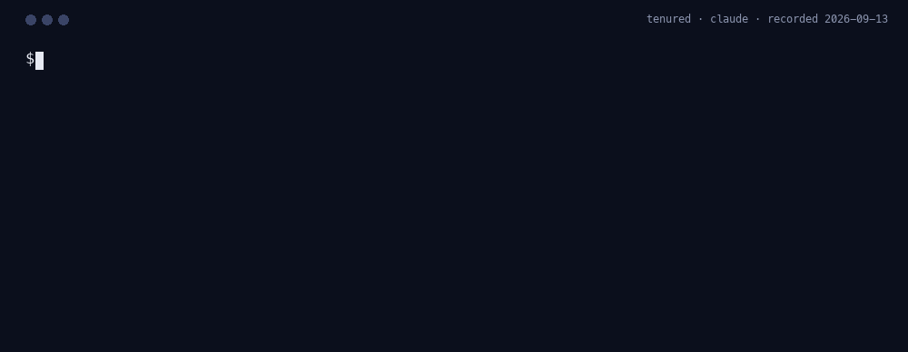
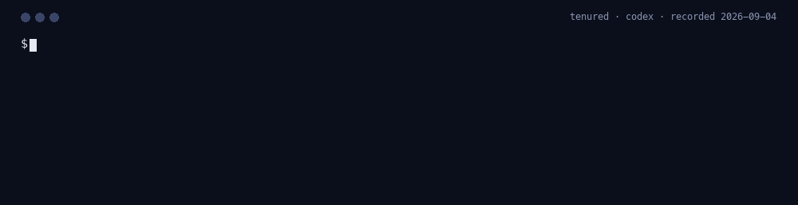
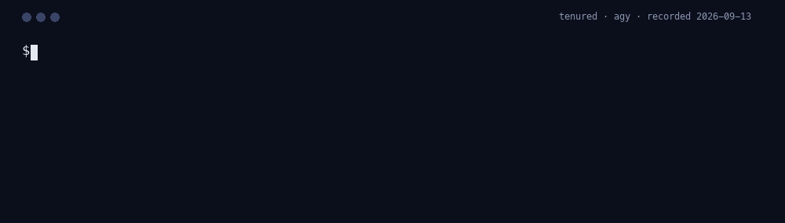
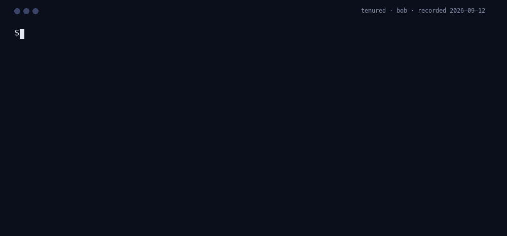
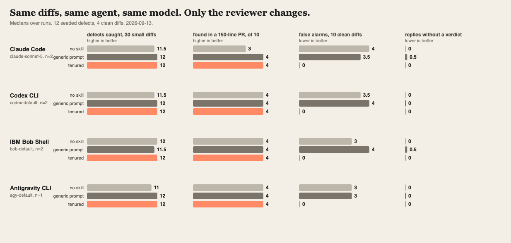

<p align="center">
  <picture>
    <source media="(prefers-color-scheme: dark)" srcset="https://lazy-senior-dev.github.io/assets/hero/tenured-dark.svg">
    <source media="(prefers-color-scheme: light)" srcset="https://lazy-senior-dev.github.io/assets/hero/tenured-light.svg">
    
  </picture>
</p>

<h1 align="center">tenured</h1>

<p align="center"><em>We tried that in 2017.</em></p>

<!-- headline:start -->
**On this corpus a careful prompt does as well as the gate.** When the agent writes the code itself, 10% of unaided runs shipped the defect, 0% with a generic "be careful" prompt, 0% with the ruleset loaded, and **0% with the gate**, which refuses the write until the findings are fixed. Measured on IBM Bob Shell (`bob-default`), 5 runs per arm; [method and raw diffs](benchmarks/results/author).

**It is quiet on code that is fine.** Across the agents tested, the median run objects to 3.5 of 4 clean changes unaided and 0 with Tenured loaded; the worst agent goes from 4 to 0. That happens on every review, not only the ones with a bug in them, which is why it is the first thing worth knowing; [per-diff table](benchmarks/results).
<!-- headline:end -->

<!-- refusals:start -->
## What it actually stops

Every one of these is a recorded run, not an illustration. The agent wrote the code; the gate refused
it before it reached the branch. Regenerate with `npm run bench:report` and this list changes with
the runs.

<table>
<tr><td>

**Q-58 "Messages sit too long when a worker dies"**

Your agent wrote:

```diff
// Q-58: a dead worker's message should reappear quickly, not after the full maximum
// processing time (240 s for large batches). So the lease we actually take out
// (LEASE_WINDOW_S) is much shorter than that, and a live worker renews it every
// HEARTBEAT_INTERVAL_S while still processing. A worker that crashes stops renewing, so the
// message becomes visible again within one missed heartbeat instead of after the full
// processing time.
```

**It was refused:** src/queue/consumer.ts:26 — `queue.receive(LEASE_WINDOW_S)` sets the actual visibility window to 30s, the value 5c71e7a deliberately raised to 300 after "duplicate deliveries at 30s" — pass a window that can't expire before renewal covers it, or otherwise show the 30s regression can't reproduce that incident

<sub>Recorded run, Claude Code. Task `visibility-timeout`.</sub>

</td></tr>
</table>
<!-- refusals:end -->

<p align="center">
  <strong>Star us&nbsp;❤️&nbsp;→</strong>&nbsp;<a href="https://github.com/lazy-senior-dev/tenured" title="Star tenured on GitHub"><picture>
    <source media="(prefers-color-scheme: dark)" srcset="https://lazy-senior-dev.github.io/assets/hero/star-dark.svg">
    <source media="(prefers-color-scheme: light)" srcset="https://lazy-senior-dev.github.io/assets/hero/star-light.svg">
    
  </picture></a>
</p>

<p align="center"><strong>Site:</strong> <a href="https://lazy-senior-dev.github.io/tenured/">lazy-senior-dev.github.io/tenured</a> · <strong>The cast:</strong> <a href="https://lazy-senior-dev.github.io/">lazy-senior-dev.github.io</a></p>

<p align="center">
  <a href="https://github.com/lazy-senior-dev/tenured"></a>
  <a href="CHANGELOG.md"></a>
  
  <a href="#github-action"></a>
  <a href="https://scorecard.dev/viewer/?uri=github.com/lazy-senior-dev/tenured"></a>
  <a href="LICENSE"></a>
</p>

<!-- hero:start -->
Your agent has no memory of your repository. It will cheerfully remove the retry cap that closed an incident, re-add the dependency you dropped for a CVE, and flip back the flag that double-charged customers.

Tenured reads your git history, your postmortems and your ADRs **before your agent is allowed to write**, and refuses the write when the change repeats one of them. A rules file cannot stop it. Anthropic's own documentation says a rules file is *"context, not enforced configuration… To block an action regardless of what Claude decides, use a PreToolUse hook instead."* That hook is what this repository is.

```sh
npx github:lazy-senior-dev/tenured review          # any repository, any agent you already have. Installs nothing.
```

```
/plugin marketplace add lazy-senior-dev/tenured
/plugin install tenured@lazy-senior-dev
```

Works with 14 coding agents from one ruleset, any MCP client, and a GitHub Action. Apache-2.0, no dependencies, no service, no account. The diff goes to the agent you already trust and nowhere else.
<!-- hero:end -->

<!-- bench:hero:start -->
**On Claude Code (`claude-sonnet-5`), Tenured catches 12 of 12 seeded defects against 12 for the agent alone. What changes is discipline: false alarms on 4 clean diffs, 0 with him, 4 without; replies with no usable verdict per run, 0 either way; 65% of DO_NOT_REPEAT verdicts land on DO_NOT_REPEAT-class defects; median review time 8 s with him, 7 s without at 573 output tokens with him, 370 output tokens without.** Median of 2 runs, measured 2026-09-06; [method, per-diff table, raw replies](benchmarks/results). **In the needle tier, where the same defect hides in a four-file, 150-line pull request, Claude Code finds 4 of 4 with Tenured, 3 without, 4 with the generic prompt.**
<!-- bench:hero:end -->

<!-- recordings:start -->
## Watch him work on every agent

The same staged diff, one CLI, 4 agents. Each recording is a real run captured with `node scripts/capture-run.mjs --agent <name>` and rendered frame by frame from the transcript, nothing typed by hand and nothing cut. The captions come from the recording itself. Captured 2026-09-04.

| Claude Code | Codex CLI |
|---|---|
|  |  |
| <b>Verdict</b> TENURED: DO_NOT_REPEAT<br><b>Findings</b> 2<br><b>Time</b> 9 s<br><b>Tokens</b> 7,737 in / 609 out | <b>Verdict</b> TENURED: DO_NOT_REPEAT<br><b>Findings</b> 1<br><b>Time</b> 5 s<br><b>Tokens</b> 15,488 in / 77 out |

| Antigravity CLI | IBM Bob Shell |
|---|---|
|  |  |
| <b>Verdict</b> TENURED: DO_NOT_REPEAT<br><b>Findings</b> 1<br><b>Time</b> 117 s<br><b>Tokens</b> 20,981 in / 56,452 out | <b>Verdict</b> TENURED: DO_NOT_REPEAT<br><b>Findings</b> 3<br><b>Time</b> 6 s<br><b>Tokens</b> not reported by the host |

Each card reads the same way. **Verdict** is what Tenured concluded: NEW lets the change through, SEEN_BEFORE asks for fixes, DO_NOT_REPEAT stops it. **Findings** counts the numbered problems he listed, each naming a file, a line, and the smallest fix. **Time** is how long the whole review took, start to finish. **Tokens** is what the host reported it read and wrote, and says so plainly when a host reports nothing. Agents that narrate the whole checklist before the verdict are shown from the verdict block down; the CLI prints it the same way. Re-capture any of them with `--agent claude|codex|agy|bob`; Bob needs `BOB_API_KEY`.
<!-- recordings:end -->

## The thirty-second version

Every repository older than a year has a graveyard: the retry loop that was capped after an incident, the flag that was reverted after it double-charged customers, the dependency removed for a CVE, the comment that says "do not lower this". An agent does not read graveyards. It sees a ticket that says "make it more resilient" and puts the unbounded retry back, cleanly, with tests.

tenured puts the person who remembers in the loop. Before a write, he looks at what the repository already knows about the files being touched (the git log, the changelog, the postmortems, the comments) and says, with a citation, whether this has been tried before and how it went. `NEW` goes through. `SEEN_BEFORE` lists the evidence and the smallest fix. `DO_NOT_REPEAT` (a recorded incident reproduced, a deliberate removal resurrected) stops the write. Same mechanics as [grumpy-reviewer](https://github.com/lazy-senior-dev/grumpy-reviewer), different source material. Works in Claude Code, Codex, Copilot CLI, IBM Bob, Antigravity, OpenCode, Cursor, and seven more. Also a GitHub Action.

## Who he is

Has been here longer than the monorepo. Keeps a plain text file called postmortems.txt with 212 entries and can quote the line numbers. Not grumpy, not paranoid; just tired of watching the same outage wear a new name. Every objection cites something the author can open: a commit, a changelog entry, a postmortem, a comment. No evidence, no objection. He approves with three words: `New to me.`

Patient, not smug. The author was not here in 2017. That is why he is.

## Before / after

**The ticket** says "Cache Get() gives up too early under load, make it more resilient". The agent writes:

```go
func (c *Client) Get(ctx context.Context, key string) ([]byte, error) {
	for {
		v, err := c.conn.Get(ctx, key)
		if err == nil {
			return v, nil
		}
		time.Sleep(10 * time.Millisecond)
	}
}
```

Resilient. Also the exact loop that took the cache cluster down for 52 minutes in 2019. Tenured reads the git log first:

```
TENURED: DO_NOT_REPEAT
1. internal/cache/client.go:11 — reintroduces the unbounded retry that 3f9c2a1 removed after INC-2019-07 (retry storm, 40x load, 52 minutes down); the postmortem's action item says do not remove the cap — keep the five-attempt cap and backoff from 3f9c2a1, raise the cap if five is too few
```

The write is denied. The agent raises the cap to eight, keeps the backoff, and reviews again:

```
TENURED: NEW — internal/cache/client.go
New to me.
```

## Numbers: reviewing a change someone else wrote

The tier above measures what Tenured changes about code the agent writes. This one measures the review itself, on diffs the agent did not author.

<!-- bench:table:start -->
| Agent | Model | Arm | Defects caught (of 12) | False alarms (of 4) | Replies without a verdict (per run) | BLOCK precision | Median input tokens | Median output tokens | Median latency |
|---|---|---|---|---|---|---|---|---|---|
| Claude Code | `claude-sonnet-5` (n=2) | no skill | 12 | 4 | 0 | n/a | 5714 | 370 | 7 s |
| Claude Code | `claude-sonnet-5` (n=2) | generic review prompt | 12 | 4 | 1 | n/a | 5820 | 794 | 11 s |
| Claude Code | `claude-sonnet-5` (n=2) | **tenured** | **12** | **0** | **0** | **65%** | 7815 | 573 | 8 s |
| Codex CLI | `codex-default` (n=2) | no skill | 12 | 4 | 0 | n/a | 14117 | 168 | 7 s |
| Codex CLI | `codex-default` (n=2) | generic review prompt | 12 | 4 | 0 | n/a | 43239 | 870 | 22 s |
| Codex CLI | `codex-default` (n=2) | **tenured** | **12** | **0** | **0** | **77%** | 15533 | 188 | 7 s |
| IBM Bob Shell | `bob-default` (n=2) | no skill | 12 | 3 | 0 | n/a | 0 | 0 | 14 s |
| IBM Bob Shell | `bob-default` (n=2) | generic review prompt | 12 | 4 | 1 | n/a | 0 | 0 | 14 s |
| IBM Bob Shell | `bob-default` (n=2) | **tenured** | **12** | **0** | **0** | **71%** | 0 | 0 | 11 s |
| Antigravity CLI | `agy-default` (n=1) | no skill | 11 | 3 | 0 | n/a | 19509 | 2058 | 42 s |
| Antigravity CLI | `agy-default` (n=1) | generic review prompt | 12 | 3 | 0 | n/a | 19590 | 5348 | 48 s |
| Antigravity CLI | `agy-default` (n=1) | **tenured** | **12** | **0** | **0** | **100%** | 20997 | 25645 | 74 s |


**Needle tier** (one defect in a four-file pull request of about 150 lines):

| Agent | Model | No skill | Generic prompt | **Tenured** |
|---|---|---|---|---|
| Claude Code | `claude-sonnet-5` (n=2) | 3/4 | 4/4 | **4/4** |
| Codex CLI | `codex-default` (n=2) | 4/4 | 4/4 | **4/4** |
| IBM Bob Shell | `bob-default` (n=2) | 4/4 | 4/4 | **4/4** |
| Antigravity CLI | `agy-default` (n=1) | 4/4 | 4/4 | **4/4** |

<!-- bench:table:end -->

Twelve changes, each shown with the history the reviewer can see and each repeating a recorded mistake: a resurrected retry loop, a reverted flag flipped back, a warning comment ignored, a deprecated API, staging config copied to production, the old side of a migration extended, a change an owner already declined, a metric name that still drives an old alert, a cache stampede from a postmortem, a dependency removed for a CVE, an ADR ignored, a deleted cron re-added. Plus four clean changes with the same history in view. Every case goes to the same agent three ways: no skill, a generic "review this carefully" prompt, and Tenured. Method, per-case table, raw replies and limitations: [benchmarks/results](benchmarks/results). Reproduce: `npm run bench && npm run bench:report`.

<p align="center"></p>

## How it works

One file, [`rules/tenured.md`](rules/tenured.md), is the whole ruleset. Every adapter in this repo is generated from it.

1. **Resurrection.** Does this re-add code, config, or behaviour a previous commit deliberately removed?
2. **Reverted before.** Has a change to these files been reverted in the last two years? Why?
3. **Postmortem match.** Does any incident note describe a failure this change could reproduce?
4. **Warnings in place.** A comment, README line, or ADR near the changed lines that says not to?
5. **Deprecated paths.** Does this call something the repository marked for removal?
6. **Copied config.** Copied from elsewhere without the parts that made it work there?
7. **Half-migration.** Does this extend the old side of a migration in progress?
8. **Ownership.** Has the owner of these files rejected a change like this before?
9. **Naming collision.** A name, flag, or event that once meant something else?
10. **Lessons recorded.** If it is new, does it leave a note the next person will find?

**The verdict**: `TENURED: NEW | SEEN_BEFORE | DO_NOT_REPEAT`, then numbered `file:line — what history says will fail — smallest fix` lines with the evidence named. `NEW` names the files it covers and is followed by `New to me.`

**What he reads.** Before each review the persona tells the agent to look at `git log --oneline -- <file>`, the changelog, `docs/postmortems*`, ADRs, and the comments around the changed lines. On hosts with tools the agent runs those commands; in the Action and the CLI the history in the diff and the repository's notes are what he sees. **Modes**: `nag` (default), `gate`, `off`, shared with every persona.

## The standards behind the checklist

Every reference below is a vendor-neutral standard: MITRE's weakness catalogue, OWASP, NIST, the SEI
CERT coding standards, the CIS benchmarks, ISO and IETF documents, and open specifications under
neutral governance. No vendor's engineering handbook, cloud provider's framework, or commercial
scanner is cited, however useful they are, because a rule you can only check against one company's
product is not a standard.

This reviewer has the least standard ground of the three, and the constraint makes that plain. The
one standard that classified software anomalies, IEEE 1044, has been inactive since 2020 with no
successor. There is no standard for architecture decision records, and none for postmortems: ISO/IEC
20000-1 and ITIL require root-cause analysis and corrective action without defining any artefact.

| Checklist question | What it maps to |
|---|---|
| Resurrection | **No standard names this.** [NIST SSDF RV.3.4](https://csrc.nist.gov/projects/ssdf), on updating the process so a root cause does not recur, is the nearest obligation |
| Reverted before | [NIST SSDF RV.3.2](https://csrc.nist.gov/projects/ssdf), analyse root causes over time to identify patterns |
| Postmortem match | [NIST SSDF RV.3.3](https://csrc.nist.gov/projects/ssdf), review the software for similar problems to eradicate a class rather than an instance |
| Warnings in place | [CWE-1116, inaccurate source code comments](https://cwe.mitre.org/data/definitions/1116.html), on a comment that carries a constraint |
| Deprecated paths | [Semantic Versioning, clause 7](https://semver.org/spec/v2.0.0.html) · [Kubernetes deprecation policy](https://kubernetes.io/docs/reference/using-api/deprecation-policy/) · [PEP 387](https://peps.python.org/pep-0387/) |
| Copied config | [Twelve-Factor: Config](https://12factor.net/config), on configuration differing by environment |
| Half-migration | **No standard names this.** [Architecture decision records](https://adr.github.io/) are a community convention with no normative format |
| Ownership | **No standard names this.** Ownership files are a platform convention, not a specification |
| Naming collision | [OpenTelemetry semantic conventions](https://opentelemetry.io/docs/specs/semconv/), on a name already carrying an agreed meaning |
| Lessons recorded | [NIST SSDF RV.3.1](https://csrc.nist.gov/projects/ssdf), record what root-cause analysis found where developers can search it |

Where no standard exists, the citation is the repository's own record: a commit, a changelog entry, a
postmortem, or the comment on the line. That is the point of this reviewer, and it is why every
finding has to name one.


## What agents actually get wrong

Every mistake these reviewers look for was recorded being made. [What coding agents actually get wrong](https://github.com/lazy-senior-dev/lazy-senior-dev.github.io/blob/main/SIGNS.md)
is an open catalogue built from the benchmark runs in these repositories: each entry names how often
an agent shipped it, on which agents, the code one of them actually wrote, and the published standard
it maps to. Nothing in it is written from memory.

## Standards this implements

Citing a standard is easy; implementing one is the part that can be checked. Everything below is
running in this repository today, and every body listed governs its specification in the open.

| Standard | Governed by | Where it runs here |
|---|---|---|
| [Model Context Protocol](https://modelcontextprotocol.io/) | Open specification, Anthropic-originated, community-governed | `mcp/server.mjs`, five tools over stdio, listed as `io.github.lazy-senior-dev/tenured` |
| [SLSA build provenance](https://slsa.dev/spec/v1.2/) | OpenSSF, Linux Foundation | Attested on every release artefact; verify with `gh attestation verify` |
| [Sigstore](https://www.sigstore.dev/) | OpenSSF, Linux Foundation | The container image is signed keyless; verify with `cosign verify` |
| [CycloneDX](https://cyclonedx.org/) | OWASP, standardised as ECMA-424 | A bill of materials on every release |
| [SPDX](https://spdx.dev/) | Linux Foundation, ISO/IEC 5962 | A second bill of materials in the format ISO recognises |
| [OpenSSF Scorecard](https://scorecard.dev/) | OpenSSF, Linux Foundation | Scored weekly, badge above, results public |
| [REUSE licence identifiers](https://reuse.software/spec/) | Free Software Foundation Europe | `SPDX-License-Identifier` on the files this project authors |
| [AGENTS.md](https://agents.md/) | Agentic AI Foundation, Linux Foundation | Generated from the ruleset for any agent that reads it |
| [Agent Skills](https://agentskills.io/) | Open specification | `skills/` and `.github/skills/` |
| [Apache-2.0](https://www.apache.org/licenses/LICENSE-2.0) | Apache Software Foundation | `LICENSE` and `NOTICE` |

## Where to get it, and how it is vetted

- **npm** — not published yet; the first tagged release will do it. Until then, `npx github:lazy-senior-dev/tenured review` works today and needs only git. The release workflow publishes through [OIDC trusted publishing](https://docs.npmjs.com/trusted-publishers), so no long-lived token is ever stored here, and npm records build provenance for the package.
- **Official MCP Registry** — the listing is `io.github.lazy-senior-dev/tenured`, published from CI with GitHub OIDC and no stored secret, so any client or platform that browses the registry can discover and configure this server with the package, transport and command already filled in. It goes live with the first tagged release, alongside the npm package it points at.
- **Container image on GHCR** — for a machine with no Node on it: `docker run --rm -i -v "$PWD:/work" -w /work ghcr.io/lazy-senior-dev/tenured`. Published by the first tagged release and built in CI with a bill of materials and SLSA build provenance attached, gated on a Trivy scan for fixable high and critical findings, and signed keyless with Cosign:

  ```sh
  cosign verify \
    --certificate-identity-regexp "^https://github.com/lazy-senior-dev/tenured/" \
    --certificate-oidc-issuer https://token.actions.githubusercontent.com \
    ghcr.io/lazy-senior-dev/tenured:latest
  ```

- **Release archive** — the adapters for every host, plus a CycloneDX bill of materials, attested by the tag build: `gh attestation verify <file> --repo lazy-senior-dev/tenured`.
- **OpenSSF Scorecard** — the repository's supply-chain posture is scored every week and published for anyone to read.
- **No runtime dependencies.** `package.json` declares none, so there is no transitive tree to audit and nothing resolved at install time. Node 22 or newer is the only requirement.

## Why not just a rules file, or a pull-request bot?

Those are the two things you already have, and they fail in opposite directions. One is advice the agent may ignore; the other arrives after the code exists.

|  | A rules file<br>(`CLAUDE.md`, `.cursorrules`) | A pull-request reviewer | tenured |
|---|---|---|---|
| **When it runs** | Every turn, as context | After the code is written and pushed | Before the write is allowed to land |
| **When it disagrees** | Nothing happens. The agent may ignore it | Leaves a comment for a human to read | Tenured denies the write until the finding is fixed |
| **What you can gate on** | Nothing | Prose | `NEW` / `SEEN_BEFORE` / `DO_NOT_REPEAT`, parsed to JSON |
| **Where it works** | One file format per host, maintained by hand | The forge you host on | 14 agents, any MCP client, and a GitHub Action, from one ruleset |
| **How you know it helps** | You do not | Vendor's own blog post | Two benchmark tiers in this repository, every raw reply committed, rerun it yourself |

The first column is not a strawman. Anthropic's own documentation says a rules file is *"context, not enforced configuration"* and that *"to block an action regardless of what Claude decides, use a PreToolUse hook instead."* That hook is what this repository is.

## Try him in 60 seconds, install nothing

```
npx github:lazy-senior-dev/tenured review            # working tree
npx github:lazy-senior-dev/tenured pr 123            # a pull request, via gh
```

Finds `claude`, `codex`, `agy`, or `bob` on your PATH, or any other agent through `LSD_AGENT_CMD`, sends the diff with his ruleset, prints the verdict, and exits 1 on anything but `NEW`.

## Install

### Claude Code

```
/plugin marketplace add lazy-senior-dev/grumpy-reviewer
/plugin install tenured@lazy-senior-dev
```

One marketplace lists the whole cast; install any persona from it.

### Everything else

```
npx github:lazy-senior-dev/tenured install <host>     # bob, cursor, windsurf, cline, kiro, qoder, opencode, gemini, copilot, agents, all
```

Antigravity: `git clone https://github.com/lazy-senior-dev/tenured ~/.tenured && agy plugin install ~/.tenured`. Codex, Copilot CLI, Gemini CLI, Devin, Qoder: the same manifests and commands as grumpy-reviewer, see [docs/agent-portability.md](docs/agent-portability.md). Uninstall: `npx github:lazy-senior-dev/tenured uninstall <host>`.

## GitHub Action

```yaml
- uses: lazy-senior-dev/tenured@v1
  with:
    mode: nag          # gate: request changes and fail the check until NEW
  env:
    ANTHROPIC_API_KEY: ${{ secrets.ANTHROPIC_API_KEY }}
```

One review per pull request, inline findings, updated in place. Runs beside the Grump's and the Paranoid SRE's Actions; each posts its own review.

## House rules, without forking

A team or an organisation adds its own checks by committing `.grumpy/policy.md` next to the code:

```markdown
- Every endpoint that writes carries an idempotency key.
- No new runtime dependency without a named owner in CODEOWNERS.
- Anything touching billing needs a second reviewer named in the pull request.
```

Tenured reads it every turn, in the hook, the CLI, the MCP server, and the Action alike. House rules are additional: they can add a finding or raise a verdict, and they can never lower one or waive a non-negotiable, which the card states so the reviewer knows the precedence. Point `policy` in `.grumpy.json` somewhere else if you keep yours elsewhere, or vendor one file into every repository from a template so a whole organisation reviews the same way.

## Any MCP client

Every editor and desktop app that speaks the Model Context Protocol can use Tenured without an adapter in this repository. The server is stdio, has no dependencies, and exposes four tools: `tenured_review_diff`, `tenured_review_staged`, `tenured_review_pr`, and `tenured_parse_verdict`, which turns a verdict block into JSON so a script can gate a commit or a merge on the level rather than on prose.

Claude Desktop (`claude_desktop_config.json`), Cursor (`~/.cursor/mcp.json`), Windsurf, and Zed:

```json
{
  "mcpServers": {
    "tenured": {"command":"npx","args":["-y","github:lazy-senior-dev/tenured","mcp"]}
  }
}
```

VS Code (`.vscode/mcp.json`):

```json
{
  "servers": {
    "tenured": { "type": "stdio", "command":"npx","args":["-y","github:lazy-senior-dev/tenured","mcp"]}
  }
}
```

Claude Code, in one line:

```sh
claude mcp add tenured -- npx -y github:lazy-senior-dev/tenured mcp
```

`tenured_review_brief` needs no API key, no agent installed, and makes no network call of its own: it hands your client the change, the ruleset, and the exact verdict format, and your client's own model does the review. That works in every MCP client with nothing to configure.

The other three review tools ask a headless agent instead (`claude`, `codex`, `agy`, `bob` with `BOB_API_KEY`, or `ANTHROPIC_API_KEY`), which is worth it when you want a second opinion from a different model than the one you are coding with. Nothing leaves your machine except the diff, going to the agent you already trust.

Every tool is annotated read-only: Tenured reviews and never edits. `tenured_parse_verdict` returns structured output against a declared schema, so a script can gate a commit or a merge on `level` rather than on prose.

## Commands

| Command | What it does |
|---|---|
| `/tenured [nag\|gate\|off]` | Set the mode. With no argument, report it. |
| `/tenured-review` | Review the working-tree diff against the repository's history. Returns a numbered list with citations. No edits. |
| `/tenured-pr <number\|url>` | Review a pull request the same way. |
| `/tenured-fix` | The only command that touches code: apply the findings from the last review, each as a separate minimal edit, then review again. |
| `/tenured-scorecard` | What Tenured caught this session, as a table. |
| `/tenured-help` | This table. |

## Same desk

Three engineers, three jobs, one install path, one mode switch.

| Persona | Reads | Verdict | Measured on |
|---|---|---|---|
| [grumpy-reviewer](https://github.com/lazy-senior-dev/grumpy-reviewer) · [site](https://lazy-senior-dev.github.io/grumpy-reviewer/) | the diff, before it reaches your branch | `GRUMP: APPROVE \| REQUEST_CHANGES \| BLOCK` | defects caught |
| [paranoid-sre](https://github.com/lazy-senior-dev/paranoid-sre) · [site](https://lazy-senior-dev.github.io/paranoid-sre/) | the deploy: manifests, charts, Terraform, CI | `SRE: SHIP \| HOLD \| PAGE` | incidents prevented per rollout |
| **tenured** · [site](https://lazy-senior-dev.github.io/tenured/) | the change against the repository's history | `TENURED: NEW \| SEEN_BEFORE \| DO_NOT_REPEAT` | repeated outages avoided |

Install all three and each reviews its own territory: the Grump reads code, the Paranoid SRE reads what runs it, Tenured reads what history says about both. Every persona is generated from one markdown ruleset with the same machinery, so a fix in one lands in all. The cast: [lazy-senior-dev.github.io](https://lazy-senior-dev.github.io/).

## Security posture

No runtime dependencies, no network calls from the hooks, every third-party action pinned to a SHA, CodeQL and OpenSSF Scorecard on every push, provenance on npm publishes, and a written [threat model](SECURITY.md#threat-model).

## FAQ

**What if the repository has no postmortems?** Then he reads the git log, the changelog, the comments, and the CODEOWNERS file, which every repository has, and he says `New to me.` more often. `/tenured-remember` (planned) will let the agent append a dated lesson to `docs/postmortems.md` so the memory grows.

**Isn't a long git log too much context?** He is told to look at the log for the files being touched, not the repository, and to cite lines, not paste them. The benchmark cases carry ten to twenty lines of history each.

**Who wrote this?** [Sandeep Bazar](https://www.linkedin.com/in/sandeepbazar/) ([@sandeepbazar](https://github.com/sandeepbazar)): fourteen years of platform infrastructure at IBM, long enough to have been the person who says "we tried that".

## Contributing

The most valuable contribution is a repeat: a bug or outage that happened twice in the same codebase, with the commit that fixed it the first time and the commit that brought it back. Open an [issue](https://github.com/lazy-senior-dev/tenured/issues); it becomes a benchmark case. Details in [CONTRIBUTING.md](CONTRIBUTING.md).

## License

[Apache-2.0](LICENSE) · by [Sandeep Bazar](https://www.linkedin.com/in/sandeepbazar/). Keep the [NOTICE](NOTICE) file with any redistribution.

Built and maintained by [Sandeep Bazar](https://www.linkedin.com/in/sandeepbazar/), part of [lazy-senior-dev](https://github.com/lazy-senior-dev).
